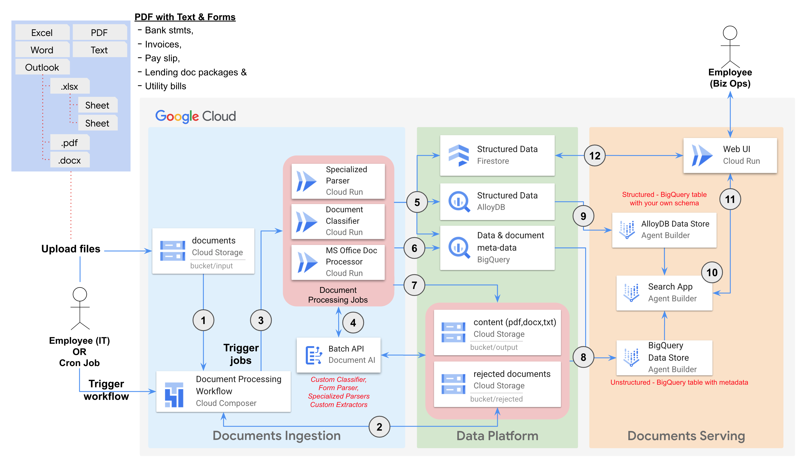

# Enterprise Knowledge Solution (EKS)

This repository contains the source code to implement the Enterprise Knowledge Solution (EKS) on Google Cloud Platform (GCP). The solution is composed of modular components that collectively enable the creation of end-to-end workflow for document processing, management and analysis:

* **Document Ingestion:** Upload and import a variety of document types.
* **Document Processing:** Validate, extract information, and transform document content.
* **Document Storage:** Securely store and manage processed documents.
* **Document Indexing:** Enabling efficient search and retrieval of document information.
* **Search and Summarization:**  Search and summarization of document content.
* **Document Retrieval:** Access to the original document files.

## Components
The solution comprises the following key components:

| Component | Description |
| -------------------------- | - |
| [Document Processing](components/processing/README.md) | Python tools and deployments for executing document processing tasks (extraction, transformation, enrichment). |
| [Common Infrastructure](components/common-infra/README.md) | Provides the shared infrastructure foundation for the EKS (networking, storage, datasets etc.). |
| [Workflow Orchestrator](components/dpu-workflow/README.md) | Orchestrates the end-to-end document processing workflow using Cloud Composer. |
| [Web UI](components/webui/README.md) | Offers a user interface for interacting with the EKS (search, summarization, document views etc). |

## Solution Architecture

    The above diagram dipicts a [Dataflow](DATAFLOW.md) of how the documents uploaded into Google Cloud Storage bucket is processed and prepared for search and summarization.


## Deployment Guide
This section provides a step-by-step instructions on how to deploy the `Enterprise Knowledge Solution` on Google Cloud using Terraform.

### Prerequisites
<<<<<<< HEAD
<<<<<<< HEAD
=======
=======
>>>>>>> db5b804 (Fixed permission issues to create Images in AR that relied on legacy (deprecated) Cloud Build SA)
<<<<<<< HEAD
To deploy this solution, you need:
- A [Google Cloud project](https://cloud.google.com/docs/overview#projects) with billing enabled.
=======
To deploy this example you need:
>>>>>>> 95796fc (initial commit. Add minimum set of IAM roles to the setup script. Further testing required to simplify friciton of bootstrapping the SA, dealing with org policies. and behavior where AR is still trying to use the default compute sa)
- An account with the [Project Owner role](https://cloud.google.com/iam/docs/understanding-roles#resource-manager-roles) on the project. This grants the necessary permissions to create and manage resources.
- An account with the [Organization Policy Admin](https://cloud.google.com/resource-manager/docs/organization-policy/creating-managing-policies) role assigned within the organization, which is required to modify the following organization policies:
=======

1. You have already completed [Create or select a Google Cloud project](https://cloud.google.com/resource-manager/docs/creating-managing-projects) and ensured that [billing is enabled for your Google Cloud project](https://cloud.google.com/billing/docs/how-to/verify-billing-enabled#console).

1. This example code is deployed through terraform using the identity of a least privilege service account. To create this service account and validate other pre-deployment checks, your user identity must have [IAM Roles](https://cloud.google.com/iam/docs/roles-overview) on your project:
    - Organization Policy Admin
    - Project IAM Admin
    - Service Account Admin
    - Service Account Token Creator
    - Service Usage Admin

<<<<<<< HEAD
1. Validate whether the following Organization Policies are enforced on this project, which can conflict with deploying the web-UI interface.
>>>>>>> 5760ebf (Fixed permission issues to create Images in AR that relied on legacy (deprecated) Cloud Build SA)
    * `compute.vmExternalIpAccess`
    * `compute.requireShieldedVm`
    * `iam.allowedPolicyMemberDomains`
>>>>>>> 7773aba (initial commit. Add minimum set of IAM roles to the setup script. Further testing required to simplify friciton of bootstrapping the SA, dealing with org policies. and behavior where AR is still trying to use the default compute sa)

1. You have already completed [Create or select a Google Cloud project](https://cloud.google.com/resource-manager/docs/creating-managing-projects) and ensured that [billing is enabled for your Google Cloud project](https://cloud.google.com/billing/docs/how-to/verify-billing-enabled#console).

1. This example code is deployed through terraform using the identity of a least privilege service account. To create this service account and validate other pre-deployment checks, your user identity must have [IAM Roles](https://cloud.google.com/iam/docs/roles-overview) on your project:
    - Organization Policy Admin
    - Project IAM Admin
    - Service Account Admin
    - Service Account Token Creator
    - Service Usage Admin

- You must deploy the customer classifier and mark it as a default version for the Cloud Composer workflow to detect it and use.

=======
>>>>>>> 9a17410 (remove inactionable steps from "prequisite" seciton of readme)
### Deploying the Sample
<<<<<<< HEAD
<<<<<<< HEAD
1. To deploy this repository using an online terminal with software and authentication preconfigured, use [Cloud Shell](https://shell.cloud.google.com/?show=ide%2Cterminal).

   Alternatively, to deploy this repository using a local terminal:
    1. [install](https://cloud.google.com/sdk/docs/install) and [initialize](https://cloud.google.com/sdk/docs/initializing) the gcloud CLI
    1. [install Terraform](https://developer.hashicorp.com/terraform/tutorials/gcp-get-started/install-cli)
    1. [install the git CLI](https://github.com/git-guides/install-git)
=======
1. To deploy this repository using an online terminal with software preconfigured, use [Cloud Shell](https://shell.cloud.google.com/?show=ide%2Cterminal).
=======
1. To deploy this repository using an online terminal with software and authentication preconfigured, use [Cloud Shell](https://shell.cloud.google.com/?show=ide%2Cterminal).
>>>>>>> 5e6b8ab (Improve the "deploying the sample" guidance under README)

   Alternatively, to deploy this repository using a local terminal:
    1. [install](https://cloud.google.com/sdk/docs/install) and [initialize](https://cloud.google.com/sdk/docs/initializing) the gcloud CLI
    1. [install Terraform](https://developer.hashicorp.com/terraform/tutorials/gcp-get-started/install-cli)
    1. [install the git CLI](https://github.com/git-guides/install-git)

<<<<<<< HEAD
1. [Create or select a Google Cloud project](https://cloud.google.com/resource-manager/docs/creating-managing-projects).

1. Make sure that [billing is enabled for your Google Cloud project](https://cloud.google.com/billing/docs/how-to/verify-billing-enabled#console).

>>>>>>> 7773aba (initial commit. Add minimum set of IAM roles to the setup script. Further testing required to simplify friciton of bootstrapping the SA, dealing with org policies. and behavior where AR is still trying to use the default compute sa)

=======
>>>>>>> db5b804 (Fixed permission issues to create Images in AR that relied on legacy (deprecated) Cloud Build SA)
1. Clone this repository

    ```sh
    git clone https://github.com/GoogleCloudPlatform/document-processing-and-understanding.git
    ```
1. Navigate to the Sample Directory:

    ```sh
    cd <YOUR_REPOSITORY>/sample-deployments/composer-orchestrated-process
    ```
    Where `<YOUR_REPOSITORY>` is the path to the directory where you cloned this repository.

<<<<<<< HEAD
<<<<<<< HEAD
=======
>>>>>>> 5e6b8ab (Improve the "deploying the sample" guidance under README)
1. Identify the service account you will use to deploy resources in this repo.
   Either confirm the identity of the service account used in your existing terraform pipeline to deploy infrastructure, or [create a service account](https://cloud.google.com/iam/docs/service-accounts-create) by running the following command:

   ```sh
   gcloud iam service-accounts create deployer \
     --description="The service account used to deploy Enterprise Knowledge Search resources"
   ```

<<<<<<< HEAD
=======
>>>>>>> 7773aba (initial commit. Add minimum set of IAM roles to the setup script. Further testing required to simplify friciton of bootstrapping the SA, dealing with org policies. and behavior where AR is still trying to use the default compute sa)
=======
>>>>>>> 5e6b8ab (Improve the "deploying the sample" guidance under README)
1. Set the following environment variables:

    ```sh
    export PROJECT_ID="<your Google Cloud project id>"
<<<<<<< HEAD
<<<<<<< HEAD
    export REGION="<Google Cloud Region for deploying the resources>"
    export DOC_AI_REGION="<Doc AI region where your Custom Document Classifier is deployed.>"
    export DOC_AI_PROCESSOR_ID="<ID for the Custom Document Classifier>"
<<<<<<< HEAD
<<<<<<< HEAD
    export SERVICE_ACCOUNT_ID="your service account identity that will be used to deploy resources"
=======
=======
>>>>>>> ee09c45 (Improve setup script to to check for effective org policies inherited to this project, not just the setting of an org policy directly at this project)
=======
    export REGION="<your Google Cloud region>"
>>>>>>> ab2d8cd (DocAI Form Parser microservice (#12))
<<<<<<< HEAD
>>>>>>> 833b7f5 (DocAI Form Parser microservice (#12))
    ```

1. Run the following script to setup your environment and your cloud project for running terraform. This script configures the following:
    - Validate software dependencies
    - Enable the required APIs defined in `project_apis.txt`.
    - Enable the required IAM roles on the service account you'll use to deploy terraform resources, defined in `project_roles.txt`.
    - Enables the required IAM roles used for underlying Cloud Build processes
    - Authenticate [Application Default Credentials](https://cloud.google.com/docs/authentication/application-default-credentials) with the credentials of your service account to be used by Terraform
    - Validate common org policies that might interfere with deploying the Web-UI interface in App Engine Flex. If you are not able to modify organization policies, you can opt to exclude the Web-UI component during by setting the Terraform variable `deploy_ui` to `false`.
        - `compute.vmExternalIpAccess`
        - `compute.requireShieldedVm`
        - `iam.allowedPolicyMemberDomains`
    - Build a custom container image used for form parsing
=======
=======
    export REGION="<your Google Cloud region for the deployment>"
    export SERVICE_ACCOUNT_ID="your service account identity that will be used to deploy resources"
>>>>>>> 95796fc (initial commit. Add minimum set of IAM roles to the setup script. Further testing required to simplify friciton of bootstrapping the SA, dealing with org policies. and behavior where AR is still trying to use the default compute sa)
=======
    export SERVICE_ACCOUNT_ID="your service account identity that will be used to deploy resources"
>>>>>>> f289fe8 (Improve setup script to to check for effective org policies inherited to this project, not just the setting of an org policy directly at this project)
    ```

1. Run the following script to setup your environment and your cloud project for running terraform. This script configures the following:
    - Validate software dependencies
    - Enable the required APIs defined in `project_apis.txt`.
    - Enable the required IAM roles on the service account you'll use to deploy terraform resources, defined in `project_roles.txt`.
    - Enables the required IAM roles used for underlying Cloud Build processes
    - Authenticate [Application Default Credentials](https://cloud.google.com/docs/authentication/application-default-credentials) with the credentials of your service account to be used by Terraform
<<<<<<< HEAD
    - Validate common org policies that might interfere with your deployment
<<<<<<< HEAD
>>>>>>> 7773aba (initial commit. Add minimum set of IAM roles to the setup script. Further testing required to simplify friciton of bootstrapping the SA, dealing with org policies. and behavior where AR is still trying to use the default compute sa)
=======
=======
    - Validate common org policies that might interfere with deploying the Web-UI interface in App Engine Flex. If you are not able to modify organization policies, you can opt to exclude the Web-UI component during by setting the Terraform variable `deploy_ui` to `false`.
        - `compute.vmExternalIpAccess`
        - `compute.requireShieldedVm`
        - `iam.allowedPolicyMemberDomains`
>>>>>>> 57c0500 (remove inactionable steps from "prequisite" seciton of readme)
    - Build a custom container image used for form parsing
>>>>>>> 5e6b8ab (Improve the "deploying the sample" guidance under README)

    ```sh
    scripts/pre_tf_setup.sh
    ```

1. Initialize Terraform:

    ```sh
    terraform init
    ```

1. Create a terraform.tfvars file with the following variables:

        project_id                  = # Your Google Cloud project ID.

        region                      = # The desired region for deploying resources (e.g., "us-central1", "europe-west1").

        vertex_ai_data_store_region = # The region for your Agent Builder Data Store, the possible values are ("global", "us", or "eu"). Choose a region the is align with you overal region of choice to avoid cross regional traffic.

        docai_location              = # Sets the location for Document AI service

        iap_admin_account           = # Account used for manage Oath brand and IAP

        iap_access_domains          = # List of domains granted for IAP access to the web-ui (e.g., ["domain:google.com","domain:example.com"])

        deploy_ui                   = # Toggler for the Web-UI component, boolean value true or false. If the scripts/pre_tf_setup.sh failed to set the required org-policies set this variable to false.

        webui_service_name          = # set this to "default" for the first run and change it if you intend to have a different service name for your App.

1. Review the proposed changes, and apply them:

    ```sh
    terraform apply
    ```
    The provisioning process may take about 30 minutes to complete.

### Update your environment with new code/new version
If you update the source code or pull the latest changes from the repository, re-run the following command to apply the changes to your deployed environment:

```sh
terraform apply
```

## Usage Guide
    This guide provides step-by-step instructions on how to use the `Enterprise Knowledge Solution (EKS)` on Google Cloud.

After successful [deployment](./sample-deployments/composer-orchestrated-process/DEPLOYMENT.md), you can test the entire EKS workflow.


### Upload Documents
1. Get the Input Bucket Name:
    ```sh
    terraform output gcs_input_bucket_name
    ```
    This command will display the name of the Cloud Storage bucket designated for uploading documents.

1. Open the Input Bucket:
    * Go to the [Cloud Storage console](https://console.cloud.google.com/storage)
    * Locate the input bucket using the name obtained in the previous step.

1. Upload Your Documents:
    * Click the "Upload Files" button or drag and drop your files into the bucket. Supported file types:
      - MS Outlook (msg)
      - MS Excel(xlsx, xlsm)
      - PDF with text only content
      - PDF with forms
      - HTML
      - TXT
      - ZIP (zip) containing any of above supported file types
### Run the document processing Workflow
1. Get the Cloud Composer Airflow URI:
    ```sh
    terraform output composer_uri
    ```
    This command will display the web interface URI of the Cloud Composer Airflow environment.
1.  Access the Airflow UI:
    * Open your web browser and navigate to the URI obtained in the previous step.
    * First time you will need to authenticate with your Google Cloud credentials.
1. Trigger the Workflow:
    * In the Airflow UI, locate the DAG (Directed Acyclic Graph) named: `run_docs_processing`, which represents the document processing workflow.
    * Click the "Trigger DAG" button to access the trigger page. Here, you can view the input parameters for the workflow.
    * Leave the default parameters as they are and click the "Trigger" button to initiate the workflow.
    * Set the following paramerts per your environment:
        * pdf_classifier_project_id
        * pdf_classifier_location
        * pdf_classifier_processor_id
1. Monitor Execution Progress:
    * Navigate to the DAG details view using the URL:
    `<composer_uri>/dags/run_docs_processing`  (replace `<composer_uri>` with the URI you obtained earlier).
    * This page displays the progress of each task in the workflow, along with logs and other details.

### Search and Explore the processed documents
Once the workflow completes successfully, all documents will be imported into the Vertex AI Agent Builder Data Store named Document Processing & Understanding`.
1. Get the Agent Build App URI:
    ```sh
    terraform output agent_app_uri
    ```
1.  Access the Agent Build App console:
    * Open your web browser and navigate to the URI obtained in the previous step.
1. Search and Explore:
    * On the console page, you'll find an input bar. Enter your questions or queries related to the documents you've uploaded.
    * The app will provide summarized answers based on the content of your documents, along with references to the specific source documents.

### Search and Explore from EKS Web-UI
1. Get the EKS Web-UI URI:
    ```sh
    terraform output web_ui_uri
    ```
1.  Access the EKS Web-UI:
    * Open your web browser and navigate to the URI obtained in the previous step.
    * First time y will need to authenticate with your Google Cloud credentials
1. Search and Explore:
    * In the `Search Documents` page, enter your questions or queries related to the documents you've uploaded and press enter to get summarized answers, along with references to the specific source documents.
    * In the `Browse Documents` page, explore and view the documents stored in the Data Store.

### Delete a document from EKS
1. Identify the document you want to delete:
    * Open Agent Builder Datastore and note down the ID and URI of the document that you want to delete from DP&U.
    * Make sure the file in the URI exists in the Google Cloud Storage bucket
    * Please note that this script will not delete the GCS Folder that contains the file
    * Based on the URI, identify and note down the name of the BQ Table that contains the document meta-data
    * Please note that this script will not delete the BQ Table that contains the document meta-data

<<<<<<< HEAD
1. Execute the bash script to delete a single document:

    ```sh
    scripts/delete_doc.sh -d <DOC_ID> -u <DOC_URI> -t <BQ_TABLE> -l <LOCATION> [-p <PROJECT_ID>]
    ```
1. Execute the bash script to delete a batch of documents:
=======
<<<<<<< HEAD
1. Execute the bash script to delete a single document:  

    ```sh
    scripts/delete_doc.sh -d <DOC_ID> -u <DOC_URI> -t <BQ_TABLE> -l <LOCATION> [-p <PROJECT_ID>]
    ```    
1. Execute the bash script to delete a batch of documents:  
=======
1. Execute the bash script to delete a document:

    ```sh
    scripts/delete_doc.sh -d <DOC_ID> -u <DOC_URI> -t <BQ_TABLE> [-p <PROJECT_ID>]
    ```
>>>>>>> 95796fc (initial commit. Add minimum set of IAM roles to the setup script. Further testing required to simplify friciton of bootstrapping the SA, dealing with org policies. and behavior where AR is still trying to use the default compute sa)
>>>>>>> 7773aba (initial commit. Add minimum set of IAM roles to the setup script. Further testing required to simplify friciton of bootstrapping the SA, dealing with org policies. and behavior where AR is still trying to use the default compute sa)

    ```sh
    scripts/delete_doc.sh -b <BATCH_ID> -l <LOCATION> [-p <PROJECT_ID>]
<<<<<<< HEAD
=======
<<<<<<< HEAD
    ``` 
For more information on the Web-UI component, please refer to its [README](./components/webui/README.md).
=======
>>>>>>> 57c0500 (remove inactionable steps from "prequisite" seciton of readme)
    ```
For more information on the Web-UI component, please refer to its [README](./components/webui/README.md).

### Customizing the document classifier

To classify documents, you must [create a custom document classifier in the Google Cloud console](https://cloud.google.com/document-ai/docs/custom-classifier).
 - You can use the [test documents and forms](sample-deployments/composer-orchestrated-process/documents-for-testing/forms-to-train-docai) to train and evaluate the classifier in your GCP environment.
<<<<<<< HEAD
 - We have created an annotated dataset to expedite the training process. Please contact your Google account representative to get access to the annotated dataset.
=======
 - We have created an annotated dataset to expedite the training process. Please contact your Google account representative to get access to the annotated dataset.
>>>>>>> 9a17410 (remove inactionable steps from "prequisite" seciton of readme)
>>>>>>> 57c0500 (remove inactionable steps from "prequisite" seciton of readme)
