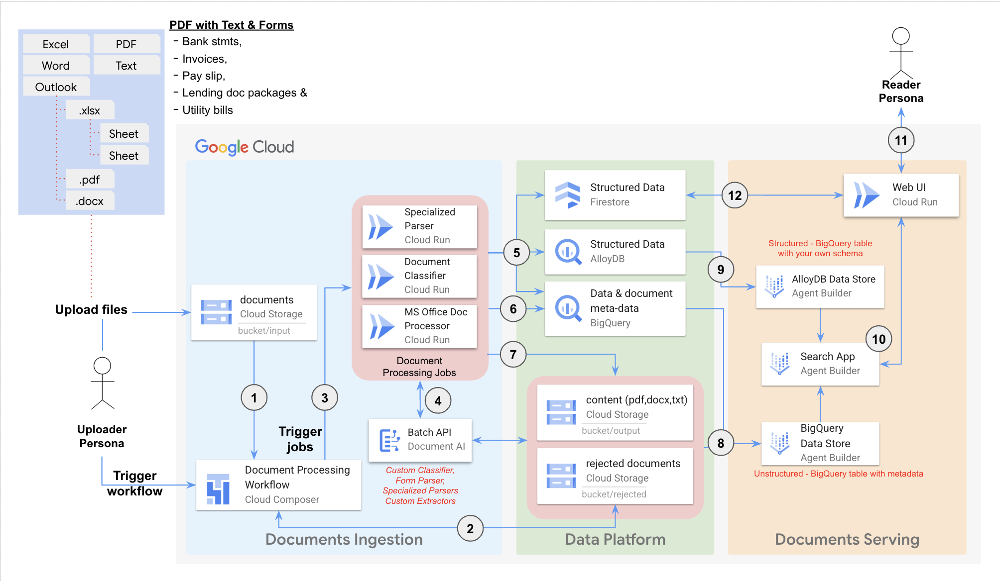

# Enterprise Knowledge Solution (EKS)

This repository contains the source code to implement the Enterprise Knowledge Solution (EKS) on the Google Cloud Platform (GCP). The solution comprises modular components that collectively enable the creation of end-to-end workflow for document processing, management, and analysis:  
- **Document Ingestion:** Upload and import a variety of document types.
- **Document Processing:** Validate, extract information, and transform document content.
- **Document Storage:** Securely store and manage processed documents.
- **Document Indexing:** Enabling efficient search and retrieval of document information.
- **Search and Summarization:** Search and summarization of document content.
- **Document Retrieval:** Access to the original documents that contibuted to the search results and summaries.

## Components  
The solution consists of the following key components:  
| Component                                                  | Description                                                                                                    |
| ---------------------------------------------------------- | -------------------------------------------------------------------------------------------------------------- |
| [Document Processing](components/processing/README.md)     | Python tools and deployments for executing document processing tasks (extraction, transformation, enrichment). |
| [Common Infrastructure](components/common-infra/README.md) | Provides the shared infrastructure foundation for the EKS (networking, storage, datasets etc.).                |
| [Workflow Orchestrator](components/dpu-workflow/README.md) | Orchestrates the end-to-end document processing workflow using Cloud Composer.                                 |
| [Web UI](components/webui/README.md)                       | Offers a user interface for interacting with the EKS (search, summarization, document views etc).              |

## Solution Architecture  

The above diagram depicts a [data flow](DATAFLOW.md) of how the documents uploaded into the Google Cloud Storage bucket are processed and prepared for search and summarization.

## Enterprise Foundations
This Solution assumes that you have already configured an enterprise-ready foundation.
The foundation is not a technical prerequisite (meaning, you can use the [deployment guide](#deployment-guide) without a foundation).
However, we recommend building an enterprise-ready foundation before releasing production workloads with sensitive data.

For more details, see [Deploying Solutions to an enterprise-ready foundation](docs/foundation.md)

## Deployment Guide

This section provides step-by-step instructions for deploying the `Enterprise Knowledge Solution` on Google Cloud using Terraform.

### Deploying an instance of Enterprise Knowledge solution in your GCP Project

To deploy this solution, perform the follow steps:

1.  [Create or select a Google Cloud project](https://cloud.google.com/resource-manager/docs/creating-managing-projects) and ensure that [billing is enabled for your Google Cloud project](https://cloud.google.com/billing/docs/how-to/verify-billing-enabled#console).

1. To provide a secure and reliable end-point to solutions Web-UI, you need to own a domain name used to access the web application. The deployment scripts provision a load balancer and a managed SSL certificate for your domain to route web traffic securely to the Web-UI application.

1. This example code is deployed through Terraform using the identity of a least privilege service account. Your user identity needs the following [IAM Roles](https://cloud.google.com/iam/docs/roles-overview) on your project to create this service account and validate other requirements with a setup script:  
    - Project IAM Admin
    - Role Admin
    - Service Account Admin
    - Service Usage Admin

1. Create, train, and deploy a custom document classifier  
   To classify documents, you must manually [create a custom document classifier in the Google Cloud console](https://cloud.google.com/document-ai/docs/custom-classifier).  
   - You can use the [test documents and forms](sample-deployments/composer-orchestrated-process/documents-for-testing/forms-to-train-docai) to train and evaluate the classifier in your GCP environment.  
   - We have created an annotated dataset to expedite the training process. To access the annotated dataset, contact your Google account representative.  
   - The output classifier labels **MUST** match the configured labels in the composer DAG configuration, `doc-ai-processors`. Out of the box, the solution supports `form` and `invoice` labels. Any other label would cause the flow to treat the document as a generic document, and it will not extract the structured data.  
   - After training the custom classifier, note down the following variable. You must set it in the Terraform variables file before running the Terraform deployment scripts.    
      | Terraform variable          | Description                                                                                |
      | --------------------------- | -------------------------------------------------------------------------------------------|
      | custom_classifier_id        | projects/<CLASSIFIER_PROJECT>/locations/ <CLASSIFIER_LOCATION>/processors/<CLASSIFIER_ID>  |

1.  To deploy the solution from this repository using an online terminal with software and authentication preconfigured, use [Cloud Shell](https://shell.cloud.google.com/?show=ide%2Cterminal)  
    Alternatively, to deploy this repository using a local terminal on MacBook:  
    1. [install](https://cloud.google.com/sdk/docs/install) and [initialize](https://cloud.google.com/sdk/docs/initializing) the gcloud CLI
    1. [install Terraform](https://developer.hashicorp.com/terraform/tutorials/gcp-get-started/install-cli)
    1. [install the Git CLI](https://github.com/git-guides/install-git)

1.  In Cloud Shell or your preferred terminal, clone this repository:  
    ```sh
    git clone https://github.com/GoogleCloudPlatform/document-processing-and-understanding.git
    ```

1.  Navigate to the Sample Directory:  
    ```sh
    cd <YOUR_REPOSITORY>/sample-deployments/composer-orchestrated-process
    ```

    Where `<YOUR_REPOSITORY>` is the path to the directory where you cloned this repository.

1.  Set the following environment variables:

    ```sh
    export PROJECT_ID="<your Google Cloud project id>"
    export REGION="<Google Cloud Region for deploying the resources>"
    export IAP_ADMIN_ACCOUNT="the email of the group or user identity displayed as the support_email field on Oauth consent screen. This must be either the email of the user running the script, or a group of which they are Owner."
    ```

1. (Optional) By default, this repository automatically creates and uses a service account `deployer@$PROJECT_ID.iam.gserviceaccount.com` to deploy Terraform resources. The necessary IAM policies and roles are automatically configured in the setup script to ease the deployment. If you have a service account in your existing terraform pipeline that you want to use instead, additionally set the optional environment variables to configure your custom deployer service account with the least privilege IAM roles:

   ```sh
   export SERVICE_ACCOUNT_ID="your existing service account identity to be used for Terraform."
   ```

1. Run the following script to set up your GCP project before running Terraform. This setup script does the following:

    - Validate software dependencies
    - Enable the required APIs defined in `project_apis.txt`
    - Enable the required IAM roles on the service account you'll use to deploy Terraform resources, defined in `persona_roles_DEPLOYER.txt`
    - Set up the OAuth consent screen (brand) required for IAP. We recommend you create this resource using a user identity instead of a service account. This approach helps avoid problems related to [support_email ownership](https://cloud.google.com/iap/docs/programmatic-oauth-clients#:~:text=the%20user%20issuing%20the%20request%20must%20be%20an%20owner%20of%20the%20specified%20support%20email%20address) and [destroying a terraform-managed Brand resource](https://registry.terraform.io/providers/hashicorp/google/latest/docs/resources/iap_brand).
    - Enables the required IAM roles used for underlying Cloud Build processes
    - Authenticate [Application Default Credentials](https://cloud.google.com/docs/authentication/application-default-credentials) with your service account credentials to be used by Terraform.
    - Build a custom container image used for form parsing

    ```sh
    scripts/pre_tf_setup.sh
    ```  
    The setup script also creates a pop-up dialog box: 'Sign in with Google' prompting you to authenticate the Google Auth Library. Follow the directions to authenticate with your user account, which will then configure Application Default Credentials (ADC) using the impersonated service account credentials to be used by Terraform.

1.  Create a terraform.tfvars file with the following variables:

      | Terraform variables         | Description                                                                                          |
      | --------------------------- | -----------------------------------------------------------------------------------------------------|
      | project_id                  | Your Google Cloud project ID.                                                                        |
      | region                      | The desired region for deploying single-region resources (e.g., "us-central1", "europe-west1").      |
      | vertex_ai_data_store_region | The multiregion for your Agent Builder Data Store, the possible values are ("global", "us", or "eu").|
      | docai_location              | Sets the location for Document AI service.                                                           |
      | webui_domains               | Your domain name for Web UI access (e.g., ["webui.example.com"])                                     |
      | iap_access_domains          | List of domains granted for IAP access to the Web UI (e.g., ["domain:example.com"])                  | 
      | custom_classifier_id        | projects/<CLASSIFIER_PROJECT>/locations/ <CLASSIFIER_LOCATION>/processors/<CLASSIFIER_ID>            |   

1.  (Optional) By default, the Terraform script creates a new VPC network in the same project as other resources. You can use an existing VPC network instead by configuring the following optional terraform variables.
      | Terraform variables         | Description                                                                                          |
      | --------------------------- | -----------------------------------------------------------------------------------------------------|
      | create_vpc_network          | false # default is true                                                                              |
      | vpc_name                    | The name of your existing vpc, (e.g., "myvpc")                                                       |

    If using an existing VPC, you should validate that your existing vpc has firewall policies and DNS zones that enable the traffic pathways defined in [vpc.tf](enterprise-knowledge-solution/components/common-infra/terraform/vpc.tf), and grant Compute Network User on your shared VPC to the deployer service account.

1.  Initialize Terraform:

    ```sh
    terraform init
    ```

1.  Review the proposed changes, and apply them:

    ```sh
    terraform apply
    ```

    The provisioning process may take approximately an hour to complete.

1.  Print the DNS configuration for the WebUI and configure the DNS records for the WebUI accordingly:

    ```sh
    terraform output webui_dns_config
    ```

1.  Migrate Terraform state to the remote Cloud Storage backend:

    ```sh
    terraform init -migrate-state
    ```

    Terraform detects that you already have a state file locally and prompts you to migrate the state to the new Cloud Storage bucket. When prompted, enter `yes`.

## Upgrade your environment with new code/new version  
To upgrade your existing environment, pull down the latest source code from this repository and re-run the following commands. If you get terraform errors, you can manually delete the Cloud Run service for Web-UI and try again.  
```sh
scripts/pre_tf_setup.sh
terraform init
terraform apply
```

## User Guide  
After successfully completing the steps in thge previous section Deployment Guide, you can test the entire EKS workflow.

### Upload Documents  
1. Get the Input Bucket Name:

   ```sh
   terraform output gcs_input_bucket_name
   ```  
   This command will display the name of the Cloud Storage bucket designated for uploading documents.

1. Open the Input Bucket:  
   - Go to the [Cloud Storage console](https://console.cloud.google.com/storage)
   - Locate the input bucket using the name obtained in the previous step.

1. Upload Your Documents:  
   - Click the "Upload Files" button or drag and drop your files into the bucket. Supported file types:
     - MS Outlook (msg)
     - MS Excel (xlsx, xlsm)
     - MS Word (docx)
     - MS PowerPoint (pptx)
     - PDF with text only content
     - PDF with forms
     - HTML
     - TXT
     - ZIP containing any of above supported file types

### Trigger the document processing Workflow  
1. Execute the following bash script to trigger the document processing workflow:  
   ```sh
   scripts/trigger_workflow.sh
   ```

### Run the document processing Workflow using Composer/Airflow UI
1. Get the Cloud Composer Airflow URI:  
   ```sh
   terraform output composer_uri
   ```  
   This command will display the web interface URI of the Cloud Composer Airflow environment.

1. Access the Airflow UI:  
   - Open your web browser and navigate to the URI obtained in the previous step.
   - First time you will need to authenticate with your Google Cloud credentials.

1. Trigger the Workflow:
   - In the Airflow UI, locate the DAG (Directed Acyclic Graph) named: `run_docs_processing`, which represents the document processing workflow.
   - Click the "Trigger DAG" button to access the trigger page. Here, you can view the input parameters for the workflow.
   - Leave the default parameters as they are and click the "Trigger" button to initiate the workflow.
   - Set the `classifier` parameter per your environment, with the following structure:

   `projects/<CLASSIFIER_PROJECT>/locations/<CLASSIFIER_LOCATION>/processors/<CLASSIFIER_ID>`

   All these parameters are available from the Cloud Console, in the classifier overview page.

1. Monitor Execution Progress:
   - Navigate to the DAG details view using the URL:
     `<composer_uri>/dags/run_docs_processing` (replace `<composer_uri>` with the URI you obtained earlier).
   - This page displays the progress of each task in the workflow, along with logs and other details.

### Search and Explore the processed documents

Once the workflow completes successfully, all documents will be imported into the Vertex AI Agent Builder Data Store named `Document Processing & Understanding`.  
1. Get the Agent Build App URI:  
   ```sh
   terraform output agent_app_uri
   ```

1. Access the Agent Build App console:  
   - Open your web browser and navigate to the URI obtained in the previous step.

1. Search and Explore:  
   - On the console page, you'll find an input bar. Enter your questions or queries related to the documents you've uploaded.
   - The app will provide summarized answers based on the content of your documents, along with references to the specific source documents.

### Search and Explore from EKS Web UI

1. Access the EKS Web UI:  
   - Open your web browser and navigate to domain address which you have configured for the WebUI.
   - First time y will need to authenticate with your Google Cloud credentials

1. Search and Explore:  
   - In the `Search Documents` page, enter your questions or queries related to the documents you've uploaded and press enter to get summarized answers, along with references to the specific source documents.
   - In the `Browse Documents` page, explore and view the documents stored in the Data Store.

For more information on the Web UI component, please refer to its [Readme](./components/webui/README.md).

### Delete a document from EKS

1. Identify the document you want to delete:  
   - Open Agent Builder Datastore and note down the ID and URI of the document that you want to delete from DP&U.
   - Make sure the file in the URI exists in the Google Cloud Storage bucket
   - Please note that this script will not delete the GCS Folder that contains the file
   - Based on the URI, identify and note down the name of the BQ Table that contains the document metadata
   - Please note that this script will not delete the BQ Table that contains the document metadata

1. Execute the following command to find a documents from the Agent Builder Datastore:  
   ```sh
   scripts/find_document.sh <DOC_ID>
   ```

1. Execute the following command to delete a single document:  
   ```sh
   scripts/delete_doc.sh [-p <PROJECT_ID>] -l <LOCATION> -u <DOC_URI> -t <BQ_TABLE> -d <DOC_ID>
   ```

1. Execute the following command to delete a batch of documents:  
   ```sh
   scripts/delete_doc.sh [-p <PROJECT_ID>] -l <LOCATION> -b <BATCH_ID>
   ```
1. Execute the following command to delete all documents from the Agent Builder Datastore:  
   ```sh
   scripts/reset_datastore.sh [-p <PROJECT_ID>] -l <LOCATION>
   ```